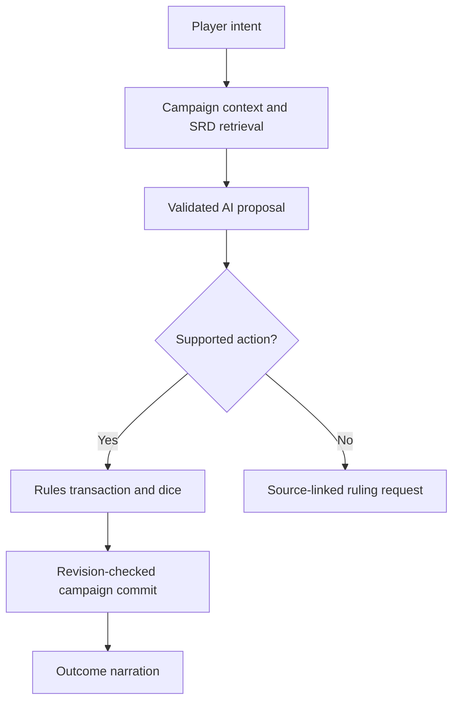

# AI Dungeon Master: implementation and completion contract

Realmweaver now includes a playable **AI Dungeon Master preview**. It uses the existing campaign store, campaign context, Claude Code provider, mock provider, UI conventions, and persistence machinery.

**This is not a complete mechanical implementation of the SRD.** All 364 pages of SRD 5.2.1 are available for retrieval and in-app reference. A bounded rules engine resolves the implemented mechanics; other mechanics require a recorded table ruling. Having the complete source available to an LLM is not equivalent to enforcing every rule.

## Run it

```bash
npm ci
npm run dev
```

Open `http://127.0.0.1:4200`, create or select a campaign, and select **AI Dungeon Master** in the sidebar.

1. Choose **Start playable demo**, or review campaign characters under **Creatures & rulings**.
2. Keep the header's Mock Mode enabled to test without a model. The demo recognises search, attack, initiative, dodge, and end-turn prompts. Its story is deliberately canned; dice and state changes still use the real engine.
3. For actual AI narration, install/authenticate Claude Code on the machine running Realmweaver, then disable Mock Mode. The existing `claude-cli` provider is used. The Anthropic API provider remains the repository's unimplemented stub.
4. Describe an action in the Play tab. The DM proposes one action, the engine resolves it, and the persisted outcome is narrated afterward. Use **Run opponent action** for an opposition creature's current action. End turns explicitly.
5. Use **SRD reference** to inspect the complete reference and open the corresponding page of the official PDF.

The Node/Vite process must remain running. A static `dist/` deployment has no AI backend. The existing loopback-only AI proxy remains in effect.

## What the preview implements

| Area | Implemented behavior | Remaining limits |
|---|---|---|
| SRD reference | 364 pages, offline text search, page citations, official source URL, source SHA-256, reproducible importer, attribution | PDF tables/stat-block reading order can require inspecting the linked original; retrieved citations do not prove an interpretation is correct |
| AI DM | Campaign-grounded scene narration, player intent, NPC roleplay, proposed mechanical actions, results-driven narration, offline mock | Real model behavior is not certified for every rule; free-form narration can still make mistakes |
| State | Per-campaign creatures, transcript, event log, HP, slots, resources, conditions, positions, initiative, rest time | Session creatures are snapshots, not live links to campaign PC records; this is a local GM application, not an authenticated multiplayer server |
| D20 tests | Ability modifiers, proficiency/expertise/half proficiency, advantage/disadvantage cancellation, attack natural 1/20, ordinary check/save natural-roll behavior | Feature-specific bonuses, perception modalities, passive checks and player-selected rerolls need further integration |
| Combat | Initiative, surprise disadvantage, turn order, action/bonus budgets, recorded Extra Attack count, ordinary weapon attacks, critical damage, cover, dodge/dash/disengage, stand/crawl, basic grapple/shove/escape | Tie decisions, reaction windows, Ready/Help/Hide, multiattack composition, mastery, ammunition/loading, map obstacles, reach-path intersections and special senses are not complete |
| Damage and survival | Resistance then vulnerability, immunity, temporary HP absorption, healing, massive damage, 0 HP, death saves, stabilization, 2024 knockout at 1 HP | Damage bundles, damage thresholds, regeneration, resurrection, stable recovery timers, and feature-specific death exceptions need additional handlers |
| Conditions | Recorded conditions affect common attacks, saves, movement and concentration; 2024 Exhaustion penalties | Frightened/Invisible attacks pause for contextual adjudication; not every interaction of every condition is automated |
| Spellcasting | Preparation, recorded slots, slot level, one slot spent per turn, action/bonus costs, verbal/somatic requirements, armor training, range and direct cover checks | Rituals, material components, concentration spell effects, AoE, Counterspell/Shield reactions, summons and arbitrary spells are not automated |
| Spell effects | 17 creature-target spell profiles, cantrip scaling, upcasting, separate rays/beams, selected timed effects and expiry | See exact list below; class modifications such as invocations/metamagic are not implicitly applied |
| Concentration | Damage saves including temporary-HP absorption; DC floor 10 and cap 30; loss on incapacitation/death; tracked expiry | Removing every linked spell effect when concentration ends needs a complete effect registry; concentration spells therefore remain unautomated |
| Rests | Uninterrupted Short Rest spending, minimum 1 HP per Hit Die; Long Rest restores recorded HP/slots/all Hit Dice, clears temporary HP, reduces Exhaustion, enforces 16-hour restart interval | Sleep eligibility, interruptions, nutrition-specific exhaustion, reduced ability/max-HP restoration and class-specific recovery exceptions are not fully modeled |
| Character math | Point-buy cost, standard array, XP thresholds, armor calculations, multiclass prerequisites, rounded-up half-caster slots, separate Pact Magic calculations | These helpers are not a complete character creator/leveling system; reviewed stat entry is required |
| Rulings | Explicit unsupported-rule message, source search, table ruling journal, validated creature editor | Recording a ruling does not execute it; a human must apply any reviewed state changes |

### Automated spells

Chill Touch, Cure Wounds, Eldritch Blast, Fire Bolt, Guiding Bolt, Heal, Healing Word, Inflict Wounds, Poison Spray, Power Word Kill, Ray of Frost, Ray of Sickness, Sacred Flame, Scorching Ray, Shocking Grasp, Starry Wisp, and Vicious Mockery.

The profiles apply to creatures using their recorded statistics. Object ignition, environmental consequences, special class features, immunities to individual spells and other exceptions need adjudication. The engine does not silently treat an unsupported spell as one of these spells.

## Technical design



`types/DungeonMaster.ts` is an optional, versioned aggregate under `Campaign.dungeonMaster`. Older campaigns need no eager migration. New state has schema version 1 and rules version 5.2.1. No existing campaign entities are replaced.

`services/rules/engine.ts` resolves typed commands on a cloned state. Invalid or unimplemented actions throw before any result can be committed; the original state remains unchanged. `dice.ts` uses cryptographic rejection sampling in normal play and injected deterministic die rolls in tests. Ability/attack bonuses are derived from reviewed creature state; AI action payloads cannot supply invented modifiers or arbitrary state patches.

`services/rules/validation.ts` validates restored state and creature edits. `campaignService.commitDungeonMaster(campaignId, expectedRevision, next)` validates the candidate and checks campaign identity, active campaign, conflict status and revision. A late response cannot overwrite a newer turn or another campaign. Duplicating a campaign intentionally clears live AI DM state, matching the existing encounter/session duplication behavior.

`services/ai/dungeonMaster.ts` retrieves SRD pages locally, expands neighboring pages for continuations, and requests a structured proposal through the existing provider. Runtime validation rejects unknown action fields, nonexistent creatures, control of a different acting creature, and citations outside the supplied excerpts. Citations are evidence references; they are not semantic verification of the model's reasoning.

`services/dungeonMasterService.ts` routes proposals through the engine and appends authoritative outcomes. The UI commits those outcomes **before** asking for final narration. If narration fails or the user navigates away, committed rolls/resources survive. Mechanical operations never come from the outcome narrator.

`components/views/AiDungeonMaster.tsx` is lazy-loaded from the existing view router. The SRD corpus is a separate lazy-loaded bundle. It shares the existing store, backups, import/export envelope and cross-tab conflict protection. The transcript and event log remain in the campaign, while recent turns are selected for the model context. Long-running campaign summarization is a remaining requirement; older transcript entries are not automatically placed in every prompt.

### Rule data provenance

- Official source: [English SRD 5.2.1](https://media.dndbeyond.com/compendium-images/srd/5.2/SRD_CC_v5.2.1.pdf).
- Publisher's current version page: [System Reference Document](https://www.dndbeyond.com/srd).
- SHA-256: `8974902d109d6e63672d7c490bde9ccf052410503d9cfa768237154fbc5e3d87`.
- Source extraction: `data/rules/srd-5.2.1.json`.
- Rebuild: `python scripts/import_srd.py /path/to/SRD_CC_v5.2.1.pdf` (requires PyMuPDF).
- The importer checks document length, version and checksum; a new source revision requires an explicit review and pin update.
- The code license remains unchanged; the SRD material has its own CC-BY-4.0 attribution in `THIRD_PARTY_NOTICES.md` and the UI.

## Verification

```bash
npm run typecheck
npm run test:rules
npm test
npm run build
npx playwright install chromium
npx playwright test e2e/ai-dungeon-master.spec.ts --project=chromium --project=mobile-chrome
```

The new tests exercise 2024-specific differences and state boundaries, including surprise, Exhaustion, critical dice, death saves, knockouts, grapple saves, Cure Wounds/Healing Word scaling, Inflict Wounds' Constitution save, Shocking Grasp's narrower reaction restriction, timed effects, source retrieval, invalid AI proposals, stale commits, campaign duplication and mock-provider isolation. The browser journey covers a resolved turn, reload persistence and SRD search.

Validated on 2026-09-21: TypeScript type checking, 1,090 tests across 151 files (70 new rules/service/component tests), and the production build passed. The new browser journey passed for desktop Chromium and Pixel 5 emulation using an environment-local Chromium 153 executable; the repository's browser configuration is unchanged. Desktop and mobile screenshots were visually reviewed. The complete existing Playwright suite was not rerun. Vite reports its large-chunk warning, including the intentionally lazy-loaded SRD reference (approximately 385 KB gzipped).

Mock/contract tests do not certify real Claude output. Real narration requires the user's local Claude Code session and was not exercised in this environment.

## What must be completed before claiming full SRD implementation

The release gate is a rule-by-rule conformance inventory with executable scenarios, not the presence of the rule text or an instruction telling an LLM to obey it.

1. **Finish core resolution.** Add explicit pending choices and reactions; all action types; Heroic Inspiration and rerolls; effect stacking and source ownership; sight/hearing/light/cover; 3D movement, flight, mounts and underwater rules; hazards and rest interruptions. Exercise simultaneous effects and all condition interactions.
2. **Build complete character and inventory state.** Implement all SRD classes/subclasses from levels 1–20, multiclass progression, origins, species, feats, equipment, mastery, attunement and consumable resources. Validate prerequisites and choices; preserve source citations for every granted feature.
3. **Implement the complete spell catalog.** Extract and verify canonical metadata, then implement each spell's target rules, components, duration, concentration, scaling, saves, area geometry, persistent effects and exceptions. A generic damage profile is insufficient for spells with secondary effects.
4. **Implement monster and item behavior.** Verify every stat block, trait, multiattack, recharge, legendary action/resistance and magic item. Bind each behavior to typed engine operations, including summons and transformations.
5. **Complete adventure operation.** Add encounter setup from verified stat blocks, NPC goals, persistent campaign memory, hidden/public information views, loot/XP/leveling and reliable scene/session progression. Automated opponents must obey the same mechanics as players.
6. **Pass conformance and playthrough gates.** Every SRD rule requires a provenance entry and passing scenario; every content item requires a supported handler or an explicitly excluded status. Full-SRD release requires zero exclusions. Test adversarial model output and long playthroughs with real providers, not only canned examples.

This preview is a concrete base for that work, with deliberately visible coverage boundaries. It should remain labeled a preview until those gates are met.
