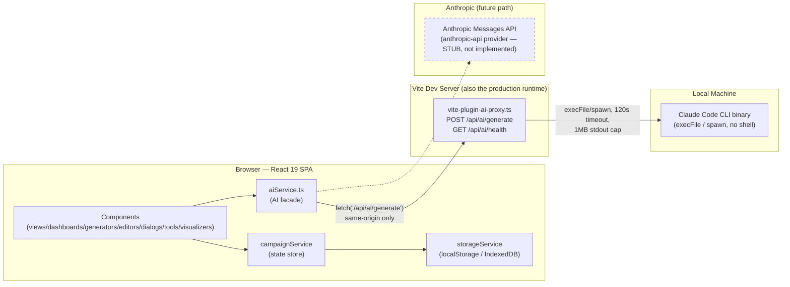
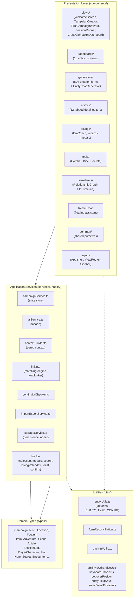
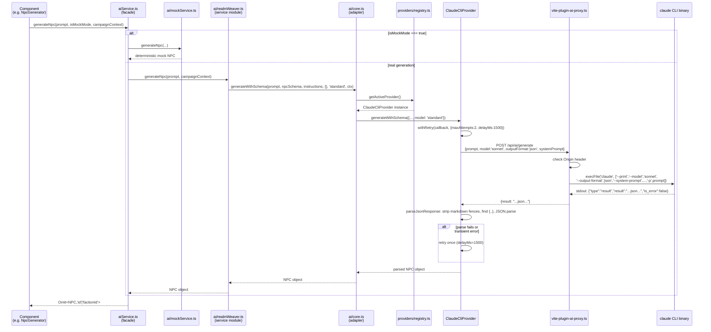
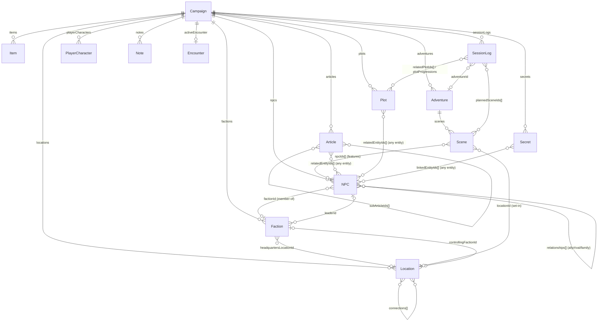

# Realmweaver — System Architecture

> **Status:** Authoritative architecture reference. Supersedes the narrative parts of
> `high-level-design.md` and `technical-design.md` as the entry point for understanding the
> system; those documents remain for phase history and implementation planning notes.
> **Verified against:** commit `a99c7ed` (tsc 0 errors, 516/516 Vitest tests passing,
> production build succeeds).
> **Last Updated:** 2026-07-17

---

## 1. Purpose & Product Overview

Realmweaver is a client-side single-page application for tabletop RPG Game Masters. It
covers the full GM workflow for one or more campaigns: building a world (NPCs, locations,
factions, items, adventures, lore articles), preparing and running sessions (session prep,
a live Session Runner with scene advancement and a running log, combat tracking, dice
rolling, secrets/clues), and keeping that world internally consistent as it grows
(cross-entity linking, backlinks, a rule-based continuity checker, a relationship graph).
AI assistance is woven through nearly every creation and editing surface — entity
generation, DM-facing narration and improvisation, a conversational world-building
assistant, batch "evocation" of a starter world, and a coach that helps run a session in
progress — but the app is fully usable in a mock-data mode with no AI backend at all.

Architecturally, Realmweaver is a "local-first" tool: there is no application server or
database. The Vite dev server doubles as the production runtime (`npm run dev` *is* how the
app is run), the AI backend is the user's own local Claude Code CLI installation (or, in a
stubbed-out future path, a direct Anthropic API integration), and all campaign data is
persisted in the browser via `localStorage` with an `IndexedDB` fallback for quota
overflow. This means the trust boundary of interest is not "client vs. server" in the
usual sense but "browser tab vs. local machine": the one network-facing surface (the AI
proxy) is deliberately restricted to same-origin, localhost-bound requests so that a
malicious web page cannot spend the user's Claude usage or exfiltrate campaign data through it.

---

## 2. Technology Stack

| Dependency | Version | Role |
|---|---|---|
| React | 19.2.0 | UI rendering; `useSyncExternalStore` is the integration point with the custom state store |
| TypeScript | 5.8.2 | Static typing across the entire codebase (no `src/`; code lives at project root) |
| Vite | 6.2.0 | Dev server, bundler, and (via `vite-plugin-ai-proxy.ts`) the AI request middleware |
| `@vitejs/plugin-react` | ^5.0.0 | React Fast Refresh / JSX transform for Vite |
| `immer` | ^10.1.3 | Structural-sharing immutable updates inside `campaignService`'s `produce()` calls |
| `tailwind-merge` | ^3.3.1 | Merges/overrides conflicting Tailwind class strings in shared components (`Button`, `MentionInput`, etc.) |
| Tailwind CSS | via CDN (`index.html` `<script src="https://cdn.tailwindcss.com">`) | Utility-class styling — **not** the npm/PostCSS build, see §12 |
| `lucide-react` | ^0.546.0 | Icon source, re-exported exclusively through `components/common/Icons.tsx` |
| `d3` | 7.8.5 | Force layout and rendering primitives for `RelationshipGraph` |
| `reactflow` | 11.10.1 | (Declared dependency; graph rendering surface) |
| `dagre` | 0.8.5 | Graph auto-layout, paired with `reactflow`/D3 for `RelationshipGraph` |
| `@anthropic-ai/sdk` | ^0.39.0 | Anthropic Messages API client — wired into the still-stubbed `anthropic-api` provider |
| `@google/genai` | ^1.25.0 | Legacy dependency from the pre-migration Gemini backend; no longer called from `services/ai/*` (see §7) |
| `@types/react`, `@types/react-dom` | ^19.2.17 / ^19.2.3 | Type declarations for React 19 — added this session; their absence had let ~20 latent type errors (incl. a pre-existing `SessionPrepWizard` bug and a missing `'scene'` union member) go undetected by `tsc` |
| Vitest | ^4.1.0 | Unit test runner (`tests/`), Node environment |
| Playwright (`@playwright/test`, `@playwright/mcp`) | ^1.58.2 / ^0.0.68 | End-to-end browser test runner (`e2e/`) |
| `typescript` | ~5.8.2 | Compiler; `npm run typecheck` runs `tsc --noEmit` as a standalone quality gate (added this session — see §11) |

---

## 3. Runtime Topology

Three processes are involved, only one of which is a "server" in any conventional sense —
and it only exists because `npm run dev` is the way this app is actually run in
production, not just in development.

**Security posture of the AI proxy** (`vite-plugin-ai-proxy.ts`):

- **Localhost bind.** `vite.config.ts` binds the dev server to `127.0.0.1` by default
  (`REALMWEAVER_DEV_HOST` env var can opt into a wider bind). This keeps `/api/ai/generate`
  unreachable from other devices on the LAN by default.
- **TCP peer address gate (mandatory).** Every request to `/api/ai/generate` and
  `/api/ai/health` is first checked against `req.socket.remoteAddress` — it must be a loopback
  address. Unlike every header below, this value is set by the kernel from the real TCP
  connection and cannot be forged by a client that controls its own request headers (curl,
  python, arbitrary scripts), which is what closes the LAN-bind exploit: forging `Origin` *and*
  `Host` to read as `localhost` from a real LAN peer is rejected outright, because the peer
  address itself isn't loopback.
- **Origin + Host validation.** Both headers must resolve to a localhost interface
  (`ALLOWED_ORIGIN_RE` / `ALLOWED_HOST_RE`) — a missing/empty Origin is rejected, not allowed
  through. Origin cannot be forged by page JS in a browser (`fetch`/`XHR` don't let script
  override it), so this is what blocks DNS-rebinding / any other page the browser happens to
  have open; Host cross-checks that the connection didn't arrive over a LAN bind.
- **Per-session proxy token (defense in depth, not yet enforced).** The plugin generates a
  random token at process start and injects it into the served page via `transformIndexHtml`;
  `X-Realmweaver-Token`, when present, is validated with a constant-time comparison and a
  mismatch is always rejected. It is not yet *required* on every request — the browser client
  doesn't send it yet (see the header comment in `vite-plugin-ai-proxy.ts` for the exact wiring
  still needed) — so today it hardens the design without yet closing the "other local process on
  the same machine" case (see §12).
- **No shell.** CLI invocation uses `execFile`/`spawn` (never a shell string), so
  arbitrary prompt content cannot achieve command injection. Prompts over 100 KB switch
  from an argv-based invocation to writing to the child process's stdin, avoiding OS
  `ARG_MAX` limits without introducing a shell.
- **Bounded resources.** Request bodies are capped at 4 MB — a request that exceeds it gets a
  `413` (the request stream is paused, not immediately destroyed, so the response actually
  reaches the client before the socket is torn down). CLI invocation has a 120 s timeout and a
  1 MB stdout buffer cap (`MAX_BUFFER`); output beyond that now **kills the child and rejects
  with `ENOBUFS`** (both the `execFile` and stdin-piped `spawn` paths) rather than silently
  truncating — the previous "silently truncated" gap is fixed, not merely documented.
  `outputFormat: 'json'` requests whose CLI output doesn't parse as the expected result envelope
  get a `502` instead of the raw, possibly-mangled text.
- **No client-side API key.** `ANTHROPIC_API_KEY` is intentionally *not* injected into the
  client bundle (`vite.config.ts`'s `define` block comments this explicitly) — the
  `claude-cli` provider doesn't need it, and the future `anthropic-api` provider would
  consume it server-side only.

---

## 4. Layered Architecture

**Layer rules enforced by convention** (see `CLAUDE.md`):

- Components call **only** `aiService.ts` for AI — never `services/ai/*` modules directly.
  `SessionLogEditor.tsx` importing `services/ai/audioTranscription.ts` directly is a known
  violation of this rule (see §12).
- Components call `campaignService` methods for all state mutation; no direct mutation of
  `Campaign` objects. Immer inside the store is what makes this safe.
- `types/index.ts` is the only import path components use for domain types (barrel export).
- `ENTITY_TYPE_CONFIG` in `utils/entityUtils.ts` is the single source of truth for entity
  icon/color/label — components must not hardcode these.

---

## 5. Component Catalog

Every file under `components/` and `services/` is listed below, grouped by directory, with
a one-line responsibility. `hooks/` and `utils/` (part of the Application/Utilities layers)
are included for completeness.

### 5.1 `components/common/` — shared primitives

| File | Responsibility |
|---|---|
| `BacklinksPanel.tsx` | Renders "Referenced By" inbound cross-references computed by `backlinkUtils.computeBacklinks`, grouped by entity type |
| `Breadcrumbs.tsx` | Navigation breadcrumb trail with back-stack support |
| `Button.tsx` | Unified button abstraction: 5 variants (primary/secondary/ghost/danger/icon) × 3 sizes, `twMerge`-composed className |
| `CommandPalette.tsx` | Ctrl+K / `/` global entity search across all entity types in the active campaign |
| `ConfirmDialog.tsx` | The modal rendered by `useConfirmDialog`'s context provider; danger/default variants |
| `DialogShell.tsx` | Base modal wrapper: focus trap, Escape-to-close, backdrop-click-to-close, body scroll lock, `role="dialog"`. Renders **inline**, not via a React portal (see §12) |
| `DmStylePanel.tsx` | DM Style (guided/standard/power) settings UI with per-feature manual overrides, `role="radiogroup"` |
| `EntityCreationPanel.tsx` | Chat-vs-form creation mode toggle used by every dashboard's "create new" flow |
| `EntityHistoryManager.tsx` | Entity version history display + undo/revert |
| `EntityLink.tsx` | Inline clickable entity reference; triggers `EntityQuickCard` hover popover |
| `EntityQuickCard.tsx` | Floating entity preview, portal-rendered, degrades to a mobile bottom sheet |
| `ErrorBoundary.tsx` | Class-based React error boundary with a styled recovery screen (Try Again / Return Home) |
| `GenerateHerePanel.tsx` | Inline "generate content for this field" trigger panel |
| `Icons.tsx` | Centralized re-export from `lucide-react` — the only file permitted to import that package |
| `KeyboardShortcutsHelp.tsx` | `?`-triggered overlay listing shortcuts from `utils/keyboardShortcuts.ts` |
| `LinkSuggestionsPanel.tsx` | Collapsible "Link Suggestions" panel: runs the matching engine against free-text fields and offers one-click add/dismiss for detected but unlinked entities |
| `LinkedText.tsx` | Auto-linkifies entity names found inside free text |
| `MentionInput.tsx` | Textarea/input with `@`-mention autocomplete; tracks a name→ID map, seeded from `initialMentions` so persisted mentions survive editor remounts, and reports `mentionedEntityIds` via `onMentionedIdsChange` |
| `RegenerateButton.tsx` | Inline AI field regeneration control with a preview/accept panel |
| `SceneResourcesPanel.tsx` | Collapsible scene NPC/location quick-reference panel |
| `SceneSmartLinkBar.tsx` | Detects NPCs/locations mentioned in a scene's text that aren't yet linked and offers one-click "+Add" |
| `SkeletonCard.tsx` | Loading-state placeholder card |
| `StepIndicator.tsx` | Multi-step wizard progress indicator |
| `TabLayout.tsx` | Reusable tabbed panel layout used by editors |
| `Textarea.tsx` | `AiTextarea` component plus the `inputBaseClasses`/`textareaBaseClasses` shared style exports |
| `ToastContainer.tsx` | Renders the toast queue managed by `useToast`'s context provider |

### 5.2 `components/layout/` — app shell

| File | Responsibility |
|---|---|
| `CampaignSidebar.tsx` | Left navigation: view switcher, entity lists per section (via `sidebar/` sub-components), DM Style panel, drag-drop scene reordering |
| `ContentWrapper.tsx` | Generic titled/icon'd content-area wrapper used by simpler views |
| `Header.tsx` | Top bar: campaign title, mock-mode toggle, save status, tool/wizard launch buttons |
| `ViewRouter.tsx` | Single large conditional that renders the active `EditorView`/selected entity/active generator — the extracted routing logic formerly inline in `App.tsx` |
| `sidebar/ArticleTreeItem.tsx` | Recursive tree-node renderer for the Lorebook's parent/child article hierarchy |
| `sidebar/PinnedEntities.tsx` | Renders the campaign's pinned-entity shortcuts (`React.memo`) |
| `sidebar/RecentItems.tsx` | Renders the last-10 recently-viewed entities (`React.memo`) |
| `sidebar/SidebarEntityList.tsx` | Generic filtered entity list renderer shared across sidebar sections (`React.memo`) |
| `sidebar/SidebarSearch.tsx` | Sidebar-local search input with clear button |
| `sidebar/sidebarUtils.ts` | Shared filter/sort helpers for sidebar entity lists |

### 5.3 `components/views/` — high-level screens

| File | Responsibility |
|---|---|
| `CampaignCreator.tsx` | New-campaign form: custom setting vs. official setting vs. template selection |
| `CrossCampaignDashboard.tsx` | Lists all locally stored campaigns with search/filter, switch/duplicate/delete |
| `FirstCampaignWizard.tsx` | 5-step guided onboarding flow that seeds a brand-new campaign via `ai/evocationWizard` batch generation |
| `SessionRunner.tsx` | Live session orchestrator: composes the `session/` sub-components, drives scene advancement |
| `WelcomeScreen.tsx` | First-launch screen: start new campaign or import an existing export |
| `session/ActiveScenePanel.tsx` | Displays the in-progress scene's read-aloud text/GM notes with copy-to-clipboard |
| `session/QuickNpcGenerator.tsx` | Inline NPC generation without leaving the live session |
| `session/QuickToolsPanel.tsx` | Quick-access panel for dice/combat/coach during a live session |
| `session/RunningLog.tsx` | Renders and edits the session's structured note timeline (manual/scene-transition/dice-roll/etc.) |
| `session/SceneListPanel.tsx` | Planned-scene list with status and reordering during a live session |

### 5.4 `components/dashboards/` — entity list views (10)

All follow the same pattern: `EntityCreationPanel` (chat/form toggle) + `useEntitySearch`
for filtering + `useRovingTabIndex` for keyboard grid navigation + a per-card completeness
indicator (green/amber/red dot based on key-field population).

| File | Entity |
|---|---|
| `AdventureDashboard.tsx` | Adventures — completeness keys: title, hook, theme, level>0 |
| `ArticleDashboard.tsx` | Lorebook articles — completeness keys: title, content, category |
| `FactionDashboard.tsx` | Factions |
| `ItemDashboard.tsx` | Items |
| `LocationDashboard.tsx` | Locations |
| `NoteDashboard.tsx` | Notes — wired into `EditorView`/`ViewRouter`/`CampaignSidebar` this session; e2e coverage still `test.skip` with a stale "not routed" comment (see §11–12) |
| `NpcDashboard.tsx` | NPCs |
| `PlayerCharacterDashboard.tsx` | Player Characters — completeness keys: name, species, class, background, player name |
| `PlotDashboard.tsx` | Plots — lazy-loads a `PlotTimeline` panel; completeness keys: title, description, status progression |
| `SessionLogDashboard.tsx` | Session Logs — lazy-loads `SessionPrepWizard`; completeness keys: title, prepNotes, recap, beats>0 |

### 5.5 `components/generators/` — AI creation forms (8 + chat)

Each accepts `isMockMode`/`campaignContext` and calls the matching `aiService.generateX`
function; the dashboard wires the result into a `campaignService.createX` call.

| File | Generates |
|---|---|
| `AdventureGenerator.tsx` | Adventures (with nested scenes) |
| `ArticleGenerator.tsx` | Lore articles |
| `EntityChatGenerator.tsx` | Multi-entity conversational generation — the engine behind RealmChat and the Evocation Wizard's chat mode |
| `FactionGenerator.tsx` | Factions |
| `ItemGenerator.tsx` | Items |
| `LocationGenerator.tsx` | Locations |
| `NpcGenerator.tsx` | NPCs |
| `PlayerCharacterImporter.tsx` | Player Characters — PDF character-sheet parsing, plus an optional "Quick Add" manual-entry tab |
| `SceneGenerator.tsx` | Scenes (nested under a selected Adventure) |

### 5.6 `components/editors/` — detail editors (12 + prep view)

All follow the tabbed-layout pattern (`TabLayout`), local `formData` state reconciled
against incoming props via `utils/formReconciliation.ts`, inline `RegenerateButton`
AI-assist, and `EntityLink`/`onNavigate` cross-references.

| File | Edits |
|---|---|
| `AdventureEditor.tsx` | Adventure (title/hook/theme/level, scene list) |
| `ArticleEditor.tsx` | Article (content, category, parent/child hierarchy, related entities) |
| `CampaignSettingEditor.tsx` | Campaign-level setting/style profile; hosts the Style Matching "analyze writing style" trigger |
| `FactionEditor.tsx` | Faction (goals, leader/members, headquarters) |
| `ItemEditor.tsx` | Item (rarity, properties) |
| `LocationEditor.tsx` | Location (hierarchy, connections, points of interest, loot) |
| `NoteEditor.tsx` | Note (title, tags, content) |
| `NpcEditor.tsx` | NPC (traits, backstory, relationships, faction link) |
| `PlayerCharacterEditor.tsx` | Player Character sheet fields |
| `PlotEditor.tsx` | Plot (status, related entities, session progression) |
| `PrepDocumentView.tsx` | Read-only printable/exportable session prep document assembled from an Adventure + Scenes |
| `SceneEditor.tsx` | Scene (read-aloud text, GM notes, skill checks, NPC/location links) — hosts `SceneSmartLinkBar` |
| `SessionLogEditor.tsx` | Session Log (prep notes, recap, beats) — the one component that imports `services/ai/audioTranscription.ts` directly, bypassing the `aiService` facade |

### 5.7 `components/dialogs/` — modals (all via `DialogShell`)

| File | Purpose |
|---|---|
| `ContinuityChecker.tsx` | Displays `continuityChecker.ts`'s rule-based issue list with navigate-to-entity links |
| `DmCoach.tsx` | In-session AI assistant: narration, improvisation, rollable tables, NPC roleplay chat |
| `EvocationWizard.tsx` | Batch "fill my campaign" / document-parsing / chat-driven multi-entity generation, reviewed before commit |
| `ExportModal.tsx` | JSON / Obsidian-markdown export trigger with entity-count summary |
| `SessionEndWizard.tsx` | End-of-session recap generation (AI) and plot-progression review |
| `SessionPrepWizard.tsx` | Pre-session planning flow: scene selection, prep notes, plot check-in |
| `WorldSimulationWizard.tsx` | Simulates world events over elapsed in-fiction time via `ai/worldSimulation` |

### 5.8 `components/tools/`, `components/visualizers/`, `components/RealmChat/`

| File | Purpose |
|---|---|
| `tools/CombatTracker.tsx` | Initiative order, HP tracking, turn advancement for the active `Encounter`; combatant removal re-locates whose turn it is after the array shifts |
| `tools/DiceRoller.tsx` | Dice formula parsing/rolling UI (`utils/diceUtils.ts`) |
| `tools/SecretsTracker.tsx` | Secrets/clues list with reveal tracking |
| `visualizers/PlotTimeline.tsx` | Chronological (by `sessionDate`) plot-progression timeline |
| `visualizers/RelationshipGraph.tsx` | D3 force-directed graph of NPC/Faction/Location relationships; maps `ENTITY_TYPE_CONFIG` Tailwind color names to hex for D3; no keyboard/ARIA interaction path (see §12) |
| `RealmChat/RealmChatWidget.tsx` | Floating conversational assistant (indigo accent — the one place indigo is permitted); drives `EntityChatGenerator` under the hood |

### 5.9 `services/` — root-level services

| File | Responsibility |
|---|---|
| `aiService.ts` | **The** AI facade. Every exported function takes `isMockMode` and dispatches to either `ai/mockService.ts` or the matching real `ai/*` module. Components must import only from here |
| `campaignService.ts` | Central state store — factory (`createCampaignStore`), Immer-based mutation, debounced auto-save, relationship sync, cascade deletion, campaign duplication with ID remapping (see §6) |
| `contextBuilder.ts` | Tiered, token-budget-aware `buildCampaignContext()` used for AI prompt assembly (see §7) |
| `continuityChecker.ts` | Pure function, 8 rule-based consistency checks over a `Campaign` (no AI) |
| `importExportService.ts` | JSON campaign export/import with schema validation and round-trip checking; Obsidian-markdown export |
| `storageService.ts` | Persistence abstraction: quota detection, IndexedDB fallback, cross-tab conflict detection, 3-slot backup rotation (see §6) |

### 5.10 `services/ai/` — AI implementation layer

| File | Responsibility |
|---|---|
| `core.ts` | Backward-compatible adapter preserving 3 legacy function signatures (`generateWithSchema`, `generateText`, `generateChatCompletion`); maps legacy Gemini model-name strings to `ModelTier`; converts Gemini-style multimodal `contents.parts` to the provider-agnostic `MultimodalPart[]`; silently drops Gemini's Google Search grounding `tools` config |
| `modelConfig.ts` | `ModelTier` type (`lite`/`standard`/`quality`), tier→CLI-alias and tier→API-model-ID mappings, `getProviderConfig()` reading provider/timeout/retry env vars |
| `realmWeaver.ts` | Entity generation: NPC/Location/Faction/Item/Scene/Adventure/Article, each with a JSON schema passed to `generateWithSchema` |
| `dmCoach.ts` | Session assistance: narration, improvisation, rollable tables, enhanced-text rewriting, session-note analysis, session recap generation |
| `evocationWizard.ts` | Batch generation (`generateCampaignFill`), document parsing into entities, PDF character-sheet parsing, chat-driven generation, starter-world generation (NPCs/locations/adventure) for the First Campaign Wizard |
| `realmChat.ts` | Conversational multi-entity chat (`chatWithRealmWeaver`) and NPC roleplay dialogue generation |
| `worldSimulation.ts` | Generates world events given elapsed days for the World Simulation Wizard |
| `styleMatching.ts` | Analyzes DM writing samples into a style-profile string used to steer future generations |
| `audioTranscription.ts` | Browser speech-recognition-based session audio transcription — imported directly by `SessionLogEditor.tsx`, bypassing `aiService`, and has no mock implementation (see §12) |
| `mockService.ts` | Static/deterministic mock implementations of every `aiService` function, used when `isMockMode` is true and by unit tests |
| `providers/types.ts` | `AIProvider` interface (`generateWithSchema`/`generateText`/`generateChatCompletion`) and option types both providers implement |
| `providers/registry.ts` | Lazy-instantiated provider registry; default provider `claude-cli`; `setProvider()`/`getActiveProvider()` |
| `providers/claude-cli.ts` | Default provider: assembles system+user prompts, POSTs to `/api/ai/generate`, runs a JSON-recovery pipeline (strip markdown fences → find `{...}` boundaries → parse), flattens multi-turn history for the CLI's non-conversational `--print` mode |
| `providers/anthropic-api.ts` | **Stub** — all three methods throw `"not yet implemented"`; TODO comments show the intended `@anthropic-ai/sdk` `tool_use` implementation shape |
| `providers/retry.ts` | `withRetry()` — retries on timeout / JSON-parse / 5xx errors, fixed delay (not exponential backoff), used by the CLI provider |

### 5.11 `services/linking/` — Smart Linking subsystem

| File | Responsibility |
|---|---|
| `matchingEngine.ts` | `TextMatchingEngine`: word-boundary-aware (Unicode `\p{L}\p{N}`) case-insensitive substring matching of entity names against free text; longest-name-first greedy, non-overlapping matches |
| `engineRegistry.ts` | Swappable-engine registry (`getMatchingEngine`/`setMatchingEngine`/`resetMatchingEngine`) — currently always resolves to `TextMatchingEngine`, but the seam exists for a future fuzzy/embedding-based engine |
| `autoLinker.ts` | `autoLinkScenes`/`autoLinkNpcFactions` — one-shot batch linking run during template/bulk import: scans scene/NPC text for entity mentions and auto-populates `npcIds`/`locationId`/`factionId` above a confidence threshold |

### 5.12 `hooks/`

| File | Responsibility |
|---|---|
| `useEntitySelection.ts` | All selected-entity-ID state, resolved-entity memos, nav stack (back button), recent items, breadcrumb computation, and the `handleSelect`/`handleEntityNavigate` dispatch used throughout `App.tsx` |
| `useModalState.ts` | Every top-level modal's open/close boolean plus `closeTopModal()` priority-ordered close (command palette > shortcuts help > continuity checker > coach > wizard > world-sim > export) |
| `useConfirmDialog.ts` | Context provider exposing `confirm(title, message, options): Promise<boolean>`, backing `ConfirmDialog` |
| `useToast.ts` | Context provider exposing `addToast(message, variant)`, capped at 3 concurrent toasts (oldest dropped first) |
| `useEntitySearch.ts` | Case-insensitive multi-field substring search with `useDeferredValue` to keep keystrokes responsive on large entity lists |
| `useRovingTabIndex.ts` | Roving-tabindex keyboard grid/list navigation; resolves a responsive column count per Tailwind breakpoint; re-anchors focus when the tracked item is unmounted (e.g. a search filter shrinks the list) |

### 5.13 `utils/`

| File | Responsibility |
|---|---|
| `entityUtils.ts` | `ENTITY_TYPE_CONFIG` (icon/color/label per entity type — `Record<string, ...>`, not a closed union; no `secret` entry), `createDefaultX()` factories (missing for Secret/Note/PlayerCharacter), `buildCampaignContext()` (a flat legacy context builder now superseded by `contextBuilder.ts` but still exported), `buildEntityContext()` (implemented and unit-tested but not called from any editor — they duplicate the logic inline), `estimatePcHp()` |
| `formReconciliation.ts` | `reconcileEntityFormData()` — merges a locally-edited form state with a freshly-arrived entity prop field-by-field, preserving in-progress edits while still picking up concurrent external changes (async AI generation, bidirectional relationship sync) that arrive mid-edit. Centralizes logic previously duplicated per-editor |
| `backlinkUtils.ts` | `computeBacklinks()` — per-entity-type inbound-reference scanners (faction membership, scene appearances, NPC relationships, article/plot references, `@mention` backlinks), grouped and sorted |
| `dmStyleUtils.ts` | `isFeatureVisible()` — resolves per-feature visibility from DM Style (guided/standard/power) defaults plus per-campaign manual overrides |
| `demoTemplates.ts` | Starter campaign demo data structures — shadow interfaces have drifted from the real `types/` definitions (see §12) |
| `diceUtils.ts` | Dice formula parsing (`XdY+Z` etc.) and rolling |
| `keyboardShortcuts.ts` | Shortcut table (`Ctrl+K` search, `Ctrl+N` new entity, `Ctrl+S` save, `Escape` close, `?` help) and `matchShortcut()` dispatch, suppressing bare-key shortcuts while focus is in a text field |
| `popoverPosition.ts` | Viewport-aware popover coordinate calculation (used by `EntityQuickCard`) |
| `entityFieldSave.ts` | Dispatches a single-field save to the correct `campaignService.updateX` call by entity type |
| `entityDetailExtractors.ts` | Extracts short display strings from entity fields for dashboard cards/quick cards |

---

## 6. State Management Deep-Dive

`campaignService.ts` exports a factory, `createCampaignStore(config)`, and a default
singleton built from it (`persist: true`). The factory pattern exists specifically so
tests can create isolated, non-persisting instances (`tests/helpers/testStoreFactory.ts`)
without touching `localStorage`.

**Core mechanics:**

- **Immer.** All mutation goes through `produce()`; callers write "mutating" code against a
  draft, Immer produces a new immutable state tree with structural sharing.
- **Two update paths.** `updateState()` (public) both mutates and calls `scheduleSave()`
  (debounced auto-save). `_internalUpdate()` (private-ish, but exposed as `_updateState`
  for tests) mutates without scheduling a save — used for UI-only state like `appStatus`/
  `saveStatus` so that e.g. opening the campaign creator doesn't itself trigger a write.
- **Debounced persistence.** `scheduleSave()` immediately flips `saveStatus` to `'saving'`,
  then debounces the actual `persistToStorage()` call by 2000 ms (`AUTO_SAVE_DELAY_MS`),
  coalescing rapid successive edits (e.g. keystrokes) into one write. `saveCampaign()`
  (manual save / `Ctrl+S`) cancels the pending timer and forces an immediate write.
- **`useSyncExternalStore` integration.** `App.tsx` subscribes via
  `useSyncExternalStore(campaignService.subscribe, campaignService.getState)` — the
  store's `listeners: Set<() => void>` plus `notify()` is the whole pub/sub mechanism.

**Persistence ladder** (`storageService.ts`):

1. `localStorage.setItem()` is tried first.
2. On `QuotaExceededError` (or the Firefox/older equivalents), the write falls back to
   **IndexedDB** (`idbSet`), and `saveStatus` surfaces as `'quota-warning'` rather than
   `'error'` — data is not lost, just relocated.
3. Once the IndexedDB write succeeds, the **stale localStorage copy is explicitly removed**
   — `load()` prefers localStorage, so leaving old data there would shadow the fresher
   IndexedDB copy on the next app start, and removing it also reclaims quota headroom.
4. `load()` (used at startup, async) checks localStorage first, then IndexedDB, so data
   that only ever made it to IndexedDB (a save from a previous session that hit quota) is
   not silently lost — this is why `init()` deliberately uses the async `load()` rather
   than a synchronous localStorage-only read.
5. **Backup rotation**: before every write, up to 3 prior snapshots are rotated into
   `CAMPAIGNS_BACKUP_1/2/3` (slot 1 = newest); `getBackups()`/`restoreFromBackup()` expose
   manual recovery. This is a `localStorage`-only mechanism — it's a full
   serialize-and-write on every save, a real (documented) perf cost (see §12).
6. **Cross-tab conflict detection**: `storageService.onConflict()` wires the `window`
   `storage` event so that a write from another tab flips `conflictDetected` in state.

**Migration / backfill.** `init()` (async, fire-and-forget inside a `void (async () => ...)`
block so the public `init()` signature stays synchronous for test stubs) parses saved JSON
and backfills every array field that might be missing on an older save — `plots`,
`notes`, `secrets`, `playerCharacters`, `relationships`, `history`, `memberIds`,
`scenes[].npcIds`, `activeEncounter` — so that later CRUD code (which assumes these arrays
always exist) never crashes on `undefined`. The same backfill logic is duplicated (not
shared) in `importCampaign()` for freshly-imported JSON, since imported data is only
lightly schema-validated.

**Cascade deletion + reference purging.** Every `deleteX()` method does two things:
type-specific relationship unwinding (e.g. `deleteNpc` unlinks the faction membership,
`deleteLocation` un-parents child locations) *and* a call to `_purgeEntityReferences()`,
which sweeps every known cross-entity reference array (NPC `relationships`/
`mentionedEntityIds`, Location/Faction/Scene `mentionedEntityIds`, Plot/Article
`relatedEntityIds`/`mentionedEntityIds`, SessionLog `relatedPlotIds`/`plotProgressions`)
for the deleted ID and strips it. `deleteAdventure` additionally strips the adventure's
(now-deleted) scene IDs out of every `SessionLog.plannedSceneIds` and clears
`activeSceneId` if it pointed into the deleted adventure — a fix from this session's
review.

**Relationship syncing.** Three private bidirectional-sync helpers keep denormalized
back-references consistent on every create/update/delete: `_synchronizeNpcFactionLink`
(NPC.factionId ↔ Faction.memberIds), `_synchronizeLocationHierarchy`
(Location.parentLocationId ↔ Location.subLocationIds, with `_isLocationParentingAllowed`
cycle detection), `_synchronizeArticleHierarchy` (same pattern for the Lorebook tree).

**`duplicateCampaign()` ID remapping.** Deep-clones a campaign for every entity array,
building a single `Map<oldId, newId>` up front (pre-registering every entity's new ID
before any field remapping happens, so forward references resolve correctly regardless of
array order), then rewrites every cross-reference field (faction membership, location
hierarchy, scene NPC/location links, session log plot/scene references, plot related
entities) through that map. Session/encounter live-state is deliberately reset rather than
cloned (`activeSceneId`/`activeSessionId` cleared, a fresh empty `activeEncounter`,
`wizardDismissed: true`, `pinnedEntities: []`).

---

## 7. AI Subsystem Deep-Dive

**Facade chain.** `aiService.ts` is the only import point components use. Every exported
function has the shape `(...args, isMockMode, campaignContext) => Promise<T>` and
dispatches to either `ai/mockService.ts` or the matching real service module
(`realmWeaver`, `dmCoach`, `evocationWizard`, `realmChat`, `worldSimulation`,
`styleMatching`). Those service modules call `ai/core.ts`'s three adapter functions
(`generateWithSchema`, `generateText`, `generateChatCompletion`) — an intentionally
preserved legacy signature from the pre-Claude-migration Gemini integration, so the six
service modules didn't need rewriting during the provider swap.

**Provider registry.** `core.ts` resolves the active provider via
`providers/registry.ts#getActiveProvider()`, which lazily instantiates and caches either
`ClaudeCliProvider` (default) or `AnthropicApiProvider` (stub — every method throws "not
yet implemented"). `setProvider()` discards the cached instance so a provider switch takes
effect on the next call. A third registry entry, `'gemini'`, exists only to throw a clear
"removed, use claude-cli" error if anything still references it.

**Model tiers.** `ModelTier = 'lite' | 'standard' | 'quality'` maps to CLI aliases
`haiku`/`sonnet`/`opus` (`mapTierToCliModel`) or full API model IDs
(`mapTierToApiModelId`, for the stub provider). `core.ts#mapLegacyModelName()` additionally
accepts legacy Gemini model-name strings (`'gemini-2.5-flash'` etc.) and maps them onto
tiers, so service-module call sites written against the old Gemini naming didn't need to
change. **Known duplication**: `types/RealmChat.ts` defines its own separate `ModelTier`
type, bridged to `services/ai/modelConfig.ts`'s version by hand-written mapping tables
rather than a shared type (see §12).

**Mock mode.** Every `aiService` function accepts `isMockMode: boolean`. `ai/mockService.ts`
provides a full deterministic implementation of every function — this is what lets the
entire app (including the dev-only `smokeTest.ts` that runs on every app load in `DEV`) be
exercised with zero AI backend, and is the same code path the 516 Vitest unit tests assert
against.

**Retry/timeout semantics.** `providers/retry.ts#withRetry()` retries once
(`maxAttempts: 2`, fixed `delayMs: 1500` — no exponential backoff, reasoned as unnecessary
given AI calls are already long-running) on: message containing `'timeout'`/`'JSON'`/
`'504'`/`'500'`, or `err.code === 'ETIMEDOUT'`. The Vite proxy layer independently enforces
a 120 s CLI timeout (`TIMEOUT_MS`) and synthesizes a reliable `ETIMEDOUT` code from the
child process's `killed`/`SIGTERM` signals — Node's own `execFile`/`spawn` timeout does
*not* set `.code` or put "timeout" in the message, so without that synthesis the retry
logic's timeout detection would never actually fire on a real CLI timeout. **No streaming**
exists anywhere in the AI layer — every call is a single request/response round trip, so a
multi-entity batch generation blocks until the whole CLI invocation completes.

**Context assembly** (`contextBuilder.ts#buildCampaignContext`). Token-budget-aware
(`maxTokenEstimate`, default 4000 tokens ≈ 16,000 chars, estimated as `chars/4`), built in
three tiers that are added in priority order and stop once the budget is exhausted:

- **Tier 1** (always, if budget allows): campaign title/setting, style profile, active
  session recap, active scene summary.
- **Tier 2** (contextual): for the `'coach'` variant, the active combat encounter first;
  NPCs present in the active scene (plus their in-scene relationships for `'coach'`); the
  scene's location; up to 5 active plot threads; full details of a `focusEntityId` if one
  is set (used for edit-continuity — "keep generating consistent with what already
  exists").
- **Tier 3** (fills remaining budget): for `'generation'`/`'chat'`, one-line overviews of
  every NPC/Location/Faction/Article-title/Adventure-title/Item-name/PC-name; for
  `'coach'`, just NPC/Location name lists (broad overviews are considered less useful
  mid-session than fast reference). A focus entity's recent history entries and the
  editor's current-selection context ("USER IS VIEWING...") are appended last if space
  remains.

This supersedes the older, flat `buildCampaignContext()` still exported from
`utils/entityUtils.ts` (kept for backward compatibility / simpler call sites like the
per-field `RegenerateButton` context) — the two are separate functions with the same name
in different modules; do not confuse them.

---

## 8. Smart Linking Subsystem

A pluggable text-matching layer (`services/linking/`) that powers four different UI
surfaces, all built on the same `EntityCandidate`/`EntityMatch` contract:

- **`matchingEngine.ts`** defines the `MatchingEngine` interface and its only current
  implementation, `TextMatchingEngine`: for each candidate name (≥3 chars, longest names
  tried first so "Duke Aldric" wins over "Duke"), it scans the text left-to-right for the
  next occurrence with a Unicode-aware word boundary on both sides (`\p{L}\p{N}`, so
  `@Ann` doesn't falsely match inside `@Annë`), advancing the cursor past each match found
  so matches never overlap.
- **`engineRegistry.ts`** is a one-function-swap seam
  (`getMatchingEngine`/`setMatchingEngine`/`resetMatchingEngine`) — currently always
  resolves to `TextMatchingEngine`, but exists so a future fuzzy or embedding-based engine
  can be substituted (and so tests can inject a fake engine) without touching call sites.
- **`autoLinker.ts`** is the one-shot **batch** consumer: `autoLinkScenes()` runs during
  template/bulk import (`campaignService.importTemplateData`) to populate `scene.npcIds`
  and `scene.locationId` from the scene's read-aloud text/GM notes, and
  `autoLinkNpcFactions()` links an NPC to a faction if exactly one faction name is
  unambiguously mentioned in their description/backstory. Both use a 0.9 minimum
  confidence.
- **Interactive consumers** call the engine directly rather than through `autoLinker.ts`:
  `SceneSmartLinkBar` (`findUnlinkedEntities`) surfaces NPCs/locations detected in a
  scene's text that aren't yet linked, as inline "+Add" chips; `LinkSuggestionsPanel` does
  the same more generally across arbitrary text fields (NPC/location/faction), with a
  lower 0.5 confidence threshold and per-suggestion dismissal tracking.

**Mention capture.** Independently, `MentionInput.tsx` implements `@`-mention autocomplete
(not matching-engine-based — it's explicit user selection from a dropdown, not text
scanning): typing `@` opens a grouped-by-type dropdown of every campaign entity;
selecting one inserts `@EntityName` into the text and records a name→ID mapping in a
`useRef` map, seeded on mount from an optional `initialMentions` prop so that IDs
persisted from a previous editing session (`mentionedEntityIds` resolved back to
candidates via `resolveMentionCandidates()`) are still recognized after remount, not just
mentions made in the current session. `findMentionedIdsInText()` (shared with the linking
engine's Unicode word-boundary logic) re-derives the current `mentionedEntityIds` set on
every keystroke.

**Backlinks.** `backlinkUtils.ts#computeBacklinks()` is the read side of the whole
subsystem: given an entity ID/type and the campaign, it returns every inbound reference
grouped by source type — structural relationships (faction membership/leadership, scene
appearances, location parent/connections, NPC-to-NPC relationships) *and* `@mention`
backlinks (scanning every entity type's `mentionedEntityIds` for the target ID) — sorted
alphabetically within each group. `BacklinksPanel.tsx` renders this as the "Referenced By"
section on every editor.

---

## 9. Cross-Cutting Concerns

- **Dialog system.** Every modal composes `DialogShell` for a consistent focus trap,
  Escape-to-close, backdrop-click, body-scroll-lock, and `role="dialog"`/`aria-modal`. It
  renders **inline in the DOM tree**, not through a React portal, and does not set
  `aria-hidden`/`inert` on the rest of the app while open (a known gap, see §12).
- **Confirmations & toasts.** `useConfirmDialog()` (context provider around
  `ConfirmDialog`) replaces `window.confirm` everywhere; `useToast()` (context provider
  around `ToastContainer`, capped at 3 concurrent toasts) replaces `window.alert`. Both are
  enforced by convention (`CLAUDE.md`), not by lint rule.
- **Keyboard shortcuts & roving tabindex.** `utils/keyboardShortcuts.ts` defines the global
  shortcut table (search, new-entity, save, close, help) and `matchShortcut()`, wired up in
  a single `App.tsx` `keydown` listener; bare-key shortcuts (no Ctrl/Cmd) are suppressed
  while focus is inside any input/textarea/contenteditable. Independently,
  `useRovingTabIndex()` gives every dashboard's entity grid arrow-key/Home/End navigation
  with only one grid cell in the natural Tab order at a time, resolving the effective
  column count from a per-breakpoint map so it stays correct across responsive layouts;
  when a filtered-out item unmounts mid-session, focus is re-anchored so the grid never
  goes entirely un-Tab-reachable.
- **Error boundaries.** `ErrorBoundary` (class component) wraps every lazy-loaded dialog
  and the `ViewRouter` output individually (keyed by `activeView`, so navigating away from
  a crashed view clears the fallback instead of it sticking around) — a crash in one panel
  does not take down the whole app or lose campaign data (which lives in `campaignService`,
  outside the crashed subtree).
- **Accessibility state.** DM Style progressive disclosure (`dmStyleUtils.ts`) hides
  advanced surfaces (continuity checker, relationship graph, plot timeline, backlinks
  panel, secrets tracker, combat tracker, keyboard shortcuts, advanced context) by default
  in `'guided'` mode for new DMs, with per-feature manual overrides always taking
  precedence over the style default. Roving-tabindex grids, `DialogShell`'s focus trap, and
  `DmStylePanel`'s `radiogroup` semantics are the concrete accessibility primitives in use;
  `RelationshipGraph` (D3 canvas/SVG) is a known exception with no keyboard path (§12).

---

## 10. Data Model

All application data lives inside a single `Campaign` object; `CampaignState` (in
`campaignService.ts`) holds an array of these plus UI-level fields (`activeCampaignId`,
`appStatus`, `saveStatus`, `lastSavedAt`, `conflictDetected`).

**Entity types and their reference fields:**

| Entity | Key reference fields |
|---|---|
| `NPC` | `factionId` (member-of); `relationships[]` (→ NPC, typed ally/rival/family); `mentionedEntityIds[]` (@mentions); `history[]` (version snapshots) |
| `Location` | `parentLocationId`/`subLocationIds[]` (hierarchy, cycle-detected); `connections[]` (→ Location); `controllingFactionId`; `mentionedEntityIds[]`; `history[]` |
| `Faction` | `leaderId`/`memberIds[]` (→ NPC, bidirectionally synced); `headquartersLocationId`; `mentionedEntityIds[]` |
| `Item` | No structural cross-references; referenced *by* Articles/Plots via `relatedEntityIds` |
| `Adventure` | `scenes: Scene[]` (owned, nested array — not a separate top-level collection) |
| `Scene` | `locationId` (set-in); `npcIds[]` (features); `mentionedEntityIds[]`; `skillChecks[]` (owned) |
| `Article` | `parentArticleId`/`subArticleIds[]` (Lorebook hierarchy, cycle-detected); `relatedEntityIds[]` (any entity type); `mentionedEntityIds[]` |
| `SessionLog` | `adventureId`; `plannedSceneIds[]`; `relatedPlotIds[]`/`plotProgressions` (per-plot status this session); `structuredNotes[]`, `diceRolls[]`, `beats[]`, `encounterLog[]` (all owned) |
| `PlayerCharacter` | No cross-references — flat `characterSocial`/`characterStatistics` sheet data |
| `Plot` | `relatedEntityIds[]` (any entity); `mentionedEntityIds[]` |
| `Note` | No cross-references; `tags[]` freeform categorization |
| `Secret` | `linkedEntityIds[]` (any entity); `revealedInSessionId` (→ SessionLog) |
| `Encounter` | `sessionId`/`sceneId` (provenance links); `combatants[]` (owned, PC/NPC/monster) |

---

## 11. Testing & Quality

| Layer | Framework | Count (verified this session) | Notes |
|---|---|---|---|
| Unit | Vitest (`tests/`, Node environment) | **516 tests / 34 files**, all passing | Covers `campaignService` (CRUD, cascade deletion, migration/backfill), `contextBuilder`, `continuityChecker`, `importExportService`, `storageService`, linking engine + `autoLinker`, `entityUtils`, `entityFieldSave`, `entityDetailExtractors`, `formReconciliation`, dice/keyboard/popover utils, AI service adapters + retry + Claude CLI provider, `MentionInput`, and five persona-driven "archetype" scenario tests (`archetype.new-dm`, `.lazy-dm`, `.forever-dm`, `.tactical-dm`, `.worldbuilder`) |
| Component (render) | — | **None** | No `@testing-library/react` dependency; `tests/components/*.test.ts` test pure exported functions (`findUnlinkedEntities`, timeline sort, combatant-removal logic) extracted *from* components, not rendered component behavior |
| E2E | Playwright (`e2e/`) | **118 tests across 13 spec files**, 6 `test.skip()` | Covers campaign CRUD/persistence, navigation, entity CRUD (core + extended), generators, dialogs, DM tools, session runner, visualizers, mobile responsiveness, RealmChat. Uses `waitForTimeout` hard waits in places (flake risk). The 2 skipped Notes tests in `entity-crud-extended.spec.ts` carry a **stale comment** ("NoteDashboard exists but is not routed") — Notes *is* now wired into `EditorView`/`ViewRouter`/`CampaignSidebar` as of this session's fixes; the tests were never re-enabled to match |
| Smoke | `smokeTest.ts`, dev-only | ~20 checks | Runs on every app load when `import.meta.env.DEV`, guarded to never run against real API calls; exercises AI service function availability and basic entity CRUD against a real `createCampaignStore` instance |
| Type check | `tsc --noEmit` via `npm run typecheck` | 0 errors | **Added this session** as a standalone script/quality gate. Adding `@types/react`/`@types/react-dom` in the same pass surfaced ~20 previously-invisible type errors, including a pre-existing `SessionPrepWizard` bug referencing `npc.race` (not a real `NPC` field) and a `DraftEntity` union missing `'scene'` |
| Manual | Mock mode | — | The entire app is usable end-to-end with `isMockMode: true` and zero AI backend — this is also what CI-less local verification and the smoke test rely on |

**Known gaps:** no CI workflow exists (`.github/workflows` is absent) to run
typecheck+test+build on push/PR — all of the above currently runs only on a developer's or
agent's machine. Tailwind is loaded via CDN `<script>` in `index.html` rather than the
PostCSS/CLI build, which is explicitly unsupported for production by Tailwind and carries
a real (~100ms+) runtime JIT cost with no unused-class purging.

---

## 12. Known Architectural Debt

Carried forward from the pre-fix review (`review-results.json`) and the adversarial-review
residuals; each item is unfixed as of this document and still real in the current code.

| Debt | Why it matters |
|---|---|
| No CI workflow | Typecheck/tests/build only run when someone remembers to run them locally; a regression can land on the default branch unnoticed |
| Tailwind via CDN | Unsupported for production per Tailwind's own docs; no purge means shipping the entire utility set, and the CDN script adds real JIT compilation cost on every page load |
| No list virtualization | Dashboard entity grids and `CommandPalette` render every result unbounded — a long-running "Forever DM" campaign with hundreds of NPCs will visibly degrade |
| `campaignService` CRUD hand-duplicated ×12 | Each entity type's create/update/delete is written out by hand rather than through a generic factory — real but consistent duplication that makes the file ~1900 lines and means a cross-cutting fix (e.g. a new cascade rule) has to be applied 12 times by hand |
| Two incompatible `ModelTier` types | `types/RealmChat.ts` and `services/ai/modelConfig.ts` each define their own `ModelTier`, bridged by hand-written mapping tables instead of one shared type — a drift risk every time a tier is added or renamed |
| `audioTranscription.ts` bypasses `aiService` | `SessionLogEditor.tsx` imports it directly, violating the "components only import `aiService`" rule; it also has no mock implementation, so it cannot be exercised in mock mode or unit-tested the way every other AI function can |
| No streaming | Every AI call is single-shot request/response with no progressive output, so a multi-entity batch generation blocks until the whole CLI invocation completes (the >1MB-stdout silent-truncation gap this used to also describe is fixed — the proxy now kills the child and rejects `ENOBUFS` instead) |
| Per-session proxy token generated but not yet required | `vite-plugin-ai-proxy.ts` injects `PROXY_TOKEN` via `transformIndexHtml` and validates `X-Realmweaver-Token` when present, but the browser client doesn't send it yet, so the mandatory gate against a same-machine-but-non-browser caller is the TCP-peer-loopback check only, not the token — see the header comment in `vite-plugin-ai-proxy.ts` for the exact client-side change that would complete this |
| `_rotateBackups` cost on every autosave | Every 2-second debounced save does a full serialize plus 3 additional `localStorage` round-trips to rotate backup slots, on top of the primary write — real overhead that scales with campaign size and autosave frequency |
| `DialogShell` renders inline, no portal/`inert` | No React portal means dialog content participates in the surrounding DOM's stacking/layout context rather than a clean top-level layer, and the background app remains in the accessibility tree (no `aria-hidden`/`inert`) while a modal is open |
| `ENTITY_TYPE_CONFIG` open `Record<string, ...>`, no `'secret'` entry | Not a closed union, so a typo'd entity-type key type-checks fine and silently falls through to no config anywhere it's looked up; `Secret` has no config entry at all, and `createDefaultSecret`/`createDefaultNote`/`createDefaultPlayerCharacter` factories don't exist alongside the other `createDefaultX()` functions in `entityUtils.ts` |
| `demoTemplates.ts` shadow interfaces drifted | Its local type shapes for demo data have diverged from the real `types/` definitions, a latent source of runtime shape mismatches if demo data is ever loaded through a path that assumes real types |
| `buildEntityContext()` unused | Implemented and unit-tested in `entityUtils.ts` but never called — every editor duplicates equivalent per-field context logic inline instead |
| No component render tests | Editors/dialogs/hooks/visualizers have zero rendered-behavior test coverage; there is no `@testing-library/react` dependency in the project at all |
| E2E hard waits; Notes e2e permanently skipped | `waitForTimeout` calls are flake-prone by nature; the 2 skipped Notes CRUD e2e tests carry a stale "not routed" comment even though Notes is now fully wired (fixed this session) — the tests were never updated to match |
| Session running-notes rely solely on debounced autosave | A crash or tab close within the 2-second autosave window during a live session loses that window's notes — there is no more-aggressive save path for in-session data specifically |
| Combat encounter discarded on session end | Only a one-line summary is archived to `SessionLog.encounterLog`; the full combatant/HP/initiative state from `activeEncounter` is not preserved in reviewable detail |
| `RelationshipGraph` has no keyboard/ARIA path | The D3 force-directed graph is mouse/touch-only; there is no way to reach or operate it via keyboard |
| `FirstCampaignWizard` batch save not atomic | A mid-loop failure while saving the wizard's generated starter entities can leave a partially-populated campaign with no rollback |
| Reconciliation: array fields stay "dirty" until remount | `formReconciliation.ts`'s field-level merge treats a changed-reference array field as user-edited even after a commit, so it won't pick up a concurrent external update to that specific field until the editor next remounts — considered benign since the array itself did just get the user's intended value |
| Pre-existing `@ts-ignore`/`as any` | Two `@ts-ignore` in `EvocationWizard` plus scattered `as any` casts elsewhere predate this session's fixes and remain |

---

## 13. Extension Guide

To add a new entity type, follow the 13-step checklist in `CLAUDE.md` ("Adding a New
Entity Type") exactly, in order: new `types/NewEntity.ts` → barrel export → `Campaign`
interface field → `campaignService` CRUD methods → `mockService.ts` mock data →
`aiService.ts` facade function → `createDefaultX()` factory → `ENTITY_TYPE_CONFIG` entry →
generator component → dashboard component (using `EntityCreationPanel` + `useEntitySearch`)
→ editor component → `EditorView` union entry in **both** `App.tsx` and `ViewRouter.tsx` →
`CampaignSidebar.tsx` entry. Skipping any step tends to fail silently rather than loudly —
e.g. a missing `ViewRouter.tsx` case just renders nothing for that view, and a missing
`ENTITY_TYPE_CONFIG` entry falls through to `undefined` wherever it's read.

Beyond that checklist, `CLAUDE.md`'s "Documentation Maintenance" table governs what else
must be updated alongside a change: new component/service/type →
`docs/architecture/high-level-design.md`; a new architecture pattern → both
`high-level-design.md` and `technical-design.md`; a new AI service function →
`CLAUDE.md`'s AI Service Integration section; a major feature → `README.md`. This document
(`system-architecture.md`) should be treated as the first place to check for whether a
change invalidates an existing claim — particularly the Component Catalog (§5) and Known
Architectural Debt (§12), which are the two sections most likely to drift out of date as
the codebase evolves.
