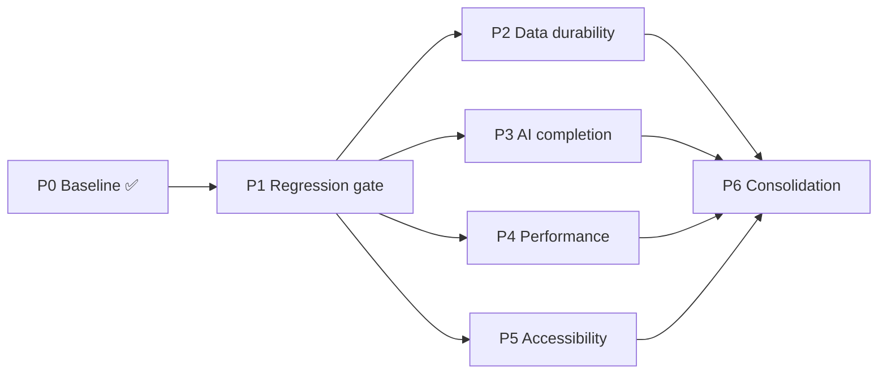

# Realmweaver Remediation Plan — Phased Execution Guide

> **Status:** Working plan. Companion to `docs/roadmap.md` (persona value/effort view) and
> `docs/architecture/system-architecture.md` §12 (debt register). Where an item exists in the
> roadmap it is referenced by its ID (N1–N6, X1–X11, L1–L9); this document sequences that same
> work as executable phases with entry/exit criteria.
> **Baseline:** branch `claude/codebase-review-roadmap-0utya9`, commit `3028f9f` —
> tsc 0 errors, 516/516 unit tests, production build green.
> **Last Updated:** 2026-07-17

---

## 1. Where the codebase actually stands

The 16-area review scored every area 5–7/10. Three areas were flagged **not fit for purpose**
(`ai-layer`, `session-tools`, `test-infra`); all three were substantially remediated in the
Phase 0 fix fleet (see §2). The remaining debt is *quality* debt — areas that work but carry
performance, structural, accessibility, or coverage liabilities.

| Area | Pre-fix score | Fit (pre-fix) | Post-Phase-0 state | Remaining debt handled in |
|---|:-:|:-:|---|:-:|
| state-store | 5 | ✅ | Cascade/remap/pointer bugs fixed, IDB fallback reachable | P2, P6 |
| ai-layer | 5 | ❌ | Error envelopes, retries, security, facade type fixed | P3 |
| context-continuity | 6 | ✅ | Import backfill + cycle dedup fixed | P2 |
| linking | 5 | ✅ | Unicode boundaries + mention persistence fixed | P6 |
| hooks | 5 | ✅ | Roving tabindex + nav-state fixes | P4, P5 |
| common-primitives | 7 | ✅ | ConfirmDialog on DialogShell, ErrorBoundary reset | P5 |
| common-entity-panels | 6 | ✅ | History type + stale-regen fixed | P4 |
| layout | 6 | ✅ | Sidebar memoization chain completed | P4 |
| dashboards | 6 | ✅ | Responsive roving columns, lookup maps | P4 |
| generators | 6 | ✅ | Cancellation guards (StrictMode-safe) | P6 |
| editors | 6 | ✅ | Dirty-aware reconciliation (shared helper) | P6 |
| session-tools | 6 | ❌ | Turn/roll/speech fixes | P2 |
| views-visualizers | 6 | ✅ | Timeline status, graph teardown, wizard dismiss | P5 |
| types-utils | 6 | ✅ | (no confirmed findings; unverified debt only) | P6 |
| dialogs-wizards | n/a | — | Reviewed + fixed separately (tsc, EvocationWizard settle) | P5 |
| test-infra | 5 | ❌ | typecheck script, smokeTest guard — **CI still missing** | **P1** |

---

## 2. Phase 0 — Baseline restoration ✅ DONE (this session)

Commits `0922913` + `a99c7ed`. Fixed ~90 verified findings: production data-wipe guard
(smokeTest), AI proxy security (localhost bind, Origin validation), fake-success error
envelopes, retry/timeout semantics, cascade deletion + duplicate-campaign remapping, editor
edit-loss races, generator stale-response/StrictMode guards, all 15 baseline tsc errors,
`@types/react` installation (+20 latent errors), 71 new unit tests.

**Exit criteria (met):** `npm run typecheck` 0 errors · 516/516 tests · build succeeds.

---

## 3. Phase 1 — Regression gate (do first; everything else depends on it)

**Goal:** no future change can land unverified. Until this exists, every later phase risks
silently regressing Phase 0.

| # | Work item | Roadmap | Files/subsystem | Effort |
|---|---|:-:|---|:-:|
| 1.1 | GitHub Actions workflow: `typecheck` + `vitest run` + `vite build` on PR and main | N1 | `.github/workflows/ci.yml` (new) | S |
| 1.2 | Component-test infrastructure: add `@testing-library/react` + jsdom env; prove it on 3 pilot tests (DialogShell focus trap, ErrorBoundary reset, editor reconciliation) | N6 | `package.json`, `vite.config.ts` test config, `tests/components/` | M |
| 1.3 | E2E stabilization: replace `waitForTimeout` hard waits with signal waits; dedupe the campaign-dropdown selector helper; **unskip Notes CRUD specs** (the Notes view is wired — the skips are stale) | — | `e2e/helpers.ts`, `e2e/*.spec.ts` | S–M |
| 1.4 | Optionally wire e2e smoke subset into CI (chromium only) | N1 | `.github/workflows/ci.yml` | S |

**Exit criteria:** red CI blocks merge; a deliberately-introduced type error and failing test
both fail CI; Notes e2e runs unskipped; zero `waitForTimeout` in e2e helpers.

---

## 4. Phase 2 — Data durability (the trust contract with the GM)

**Goal:** a GM mid-session can lose at most a few seconds of work under any failure
(tab crash, quota, browser kill). This is the highest-stakes remaining not-fit residue
(`session-tools`, `state-store`).

| # | Work item | Roadmap | Files/subsystem | Effort |
|---|---|:-:|---|:-:|
| 2.1 | Session-runner durability: flush-on-critical-events (scene advance, combat round, note commit) + `visibilitychange`/`pagehide` flush, alongside the 2s debounce | N3 | `services/campaignService.ts`, `components/views/session/RunningLog.tsx` | M |
| 2.2 | Autosave cost: stop `_rotateBackups` doing 3 full-campaign localStorage round-trips per save — rotate on interval/count threshold instead | N3 | `services/storageService.ts` | S |
| 2.3 | Combat encounter archiving: persist full combatant/HP/round state on `handleEndCombat` instead of a one-line summary | X6 | `components/views/SessionRunner.tsx`, `campaignService.ts`, `types/Encounter.ts` | S |
| 2.4 | Import hardening beyond array backfill: version-stamped exports, per-entity salvage report on partial import, FirstCampaignWizard batch-save made idempotent (pre-generated IDs, resume on retry) | L9 (partial) | `services/importExportService.ts`, `components/views/FirstCampaignWizard.tsx` | M |

**Exit criteria:** kill-tab test loses <5s of running-log data; ending combat and reopening
the session log shows full encounter state; re-running a failed wizard step creates no
duplicates; storage tests cover quota + rotation paths.

---

## 5. Phase 3 — AI layer completion (finish the not-fit remediation)

**Goal:** the AI layer's architecture rules hold everywhere, and its remaining known
failure modes are visible instead of silent.

| # | Work item | Roadmap | Files/subsystem | Effort |
|---|---|:-:|---|:-:|
| 3.1 | Buffer truncation visibility: spawn path errors (413-style) instead of silently truncating >1MB stdout; surface AI errors with real causes in generator UIs | N5 | `vite-plugin-ai-proxy.ts`, generators | S |
| 3.2 | `audioTranscription.ts` facade compliance: route through `aiService.ts`, add the missing mock | X3 | `services/aiService.ts`, `services/ai/audioTranscription.ts`, `mockService.ts`, `SessionLogEditor.tsx` | M |
| 3.3 | ModelTier unification: one tier type (`lite/standard/quality`), delete the hand-mapped bridge tables | X2 | `types/RealmChat.ts`, `services/ai/modelConfig.ts`, `RealmChatWidget` | S |
| 3.4 | Streaming responses for conversational surfaces (RealmChat, EntityChatGenerator, DM Coach) via SSE through the proxy | X5 | proxy plugin, `providers/*`, chat components | L |
| 3.5 | Complete or explicitly quarantine the `anthropic-api` provider stub (docs say "future"; code half-exists); drop unused `@google/genai` dependency | — | `services/ai/providers/anthropic-api.ts`, `package.json` | S–M |

**Exit criteria:** grep proves zero component imports from `services/ai/*`; every facade
function has a mock (assert via test); >1MB response produces a visible error; chat streams.

---

## 6. Phase 4 — Performance at scale (Forever DM / Worldbuilder ceiling)

**Goal:** a 500+ entity campaign stays responsive. All items are measurable, so this phase
starts by building the measurement.

| # | Work item | Roadmap | Files/subsystem | Effort |
|---|---|:-:|---|:-:|
| 4.1 | Seed script for a synthetic 500-NPC / 200-location campaign + a documented manual perf checklist (or Playwright trace) — the phase's yardstick | — | `data/`, `e2e/` | S |
| 4.2 | Virtualize dashboard grids + cap/virtualize CommandPalette results | N4 | all 10 dashboards, `CommandPalette.tsx` | M |
| 4.3 | Lorebook tree: precompute children map instead of filtering the full article array at every node (O(n²) → O(n)) | N4 | `components/layout/sidebar/ArticleTreeItem.tsx` | S |
| 4.4 | EntityHistoryManager: scope its `useMemo` deps and stop rescanning all NPC/location histories on unrelated campaign changes | — | `components/common/EntityHistoryManager.tsx` | S |
| 4.5 | Editor cycle-detection scan memoization (LocationEditor `possibleParents`) | — | `components/editors/LocationEditor.tsx` | S |
| 4.6 | Tailwind build migration: replace the CDN JIT script with the PostCSS build (also removes the production-unsupported dependency and cuts first-paint cost) | N2 | `index.html`, `package.json`, `tailwind.config`, `vite.config.ts` | M |

**Exit criteria:** with the synthetic campaign — dashboard render and palette keystroke stay
under agreed budgets (suggest <100ms interaction); no full-tree re-filter in profiler; app
boots with zero CDN requests.

---

## 7. Phase 5 — Accessibility & interaction correctness

**Goal:** every interactive surface has a keyboard path and honest ARIA. Requires Phase 1.2
(component tests) to lock behaviors in.

| # | Work item | Roadmap | Files/subsystem | Effort |
|---|---|:-:|---|:-:|
| 5.1 | DialogShell: portal rendering + background `inert`/`aria-hidden` while open | X4 | `components/common/DialogShell.tsx` | M |
| 5.2 | Mobile sidebar drawer: DialogShell semantics (Escape, focus trap) | — | `App.tsx` | S |
| 5.3 | TabLayout: real `aria-controls` targets + arrow-key navigation | — | `components/common/TabLayout.tsx` | S |
| 5.4 | RelationshipGraph keyboard path: focusable nodes, Enter-to-navigate, ARIA description | X8 | `components/visualizers/RelationshipGraph.tsx` | M |
| 5.5 | Sweep: toast `role="alert"`/`aria-live` contradiction, unlabeled combat number inputs, POI toggle `aria-expanded`, browser-reserved Ctrl+N rebind | — | ToastContainer, CombatTracker, LocationEditor, keyboardShortcuts | S |

**Exit criteria:** axe scan of the main surfaces reports no serious violations; every modal
and the graph are operable keyboard-only (verified by component/e2e tests).

---

## 8. Phase 6 — Structural consolidation (the long tail; safe only after P1)

**Goal:** collapse the copy-paste surfaces so the next 12 months of features don't multiply
the same bugs. Deliberately last: highest churn, zero user-visible change, needs the CI +
component-test safety net.

| # | Work item | Roadmap | Effort |
|---|---|:-:|:-:|
| 6.1 | Generic entity CRUD factory in campaignService (12 hand-rolled triplets → one registry-driven helper; referential-integrity purge declared per entity type) | X1 | L |
| 6.2 | Generator consolidation: one configurable quick-generate form behind the 7 near-duplicates; typed `EntityChatGenerator` contract (`any` → generics) | L1 | L |
| 6.3 | ENTITY_TYPE_CONFIG closed union + missing `secret` entry + missing default factories; `buildEntityContext` adopted by editors (kill inline duplicates) | X10, X11 | M |
| 6.4 | Linking unification: LinkedText adopts the engine registry; confidence/ambiguity signals in matches | L7 | M |
| 6.5 | Selection/navigation consolidation: replace the ~40-prop drill (App → ViewRouter) with a navigation context/reducer | L6 | XL |
| 6.6 | Type hygiene: root `types.ts` shim removal, demoTemplates drift, remaining `as any`/`@ts-ignore` (EvocationWizard ×2), unused Graph enum members | — | S–M |

**Exit criteria:** adding a hypothetical 13th entity type touches ≤6 files (today: 13 steps);
no `as any` in editors/generators; one matching engine serves all link surfaces.

---

## 9. Sequencing at a glance

- **P1 is the only hard gate.** P2–P5 are independent of each other and can run in parallel
  (they touch mostly disjoint subsystems — the same disjoint-ownership split used by this
  session's fix fleet works for them).
- Suggested order if serialized: **P1 → P2 → P3 → P4 → P5 → P6** (trust before features,
  visible failure before streaming, measurement before optimization, safety net before churn).
- Rough sizing: P1 ≈ 1 sprint · P2 ≈ 1 · P3 ≈ 1.5–2 · P4 ≈ 1.5 · P5 ≈ 1 · P6 ≈ 2–3.

Persona-facing feature work from `docs/roadmap.md` (prep-to-play bridge L3, structured combat
X7/L5, onboarding revamp L8, cross-campaign reuse L4) can interleave after P2; this document
covers remediation only.
